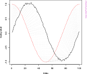

# Welcome to the Dynamic Time Warp suite!

DTW is a family of algorithms which compute the local stretch or
compression to apply to the time axes of two timeseries in order to
optimally map one (query) onto the other (reference). DTW outputs the
remaining cumulative distance between the two and, if desired, the
mapping itself (warping function). DTW is [widely
used](http://scholar.google.it/scholar?oi=bibs&hl=it&cites=5151555337428350289)
for classification and clustering tasks, e.g. in bioinformatics,
chemometrics, econometrics, and general timeseries mining.

The packages [**dtw**](http://cran.r-project.org/web/packages/dtw/index.html) for R and
[**dtw-python**](https://pypi.org/project/dtw-python/) for Python
provide the most complete, freely-available (GPL) implementation of
Dynamic Time Warping-type (DTW) algorithms up to date.  They support
arbitrary local (eg symmetric, asymmetric, slope-limited) and global
(windowing) constraints, fast native code, several plot styles, and
more.

The R package is described in a [companion
paper](http://www.jstatsoft.org/v31/i07/) which includes detailed
instructions and extensive background on things like multivariate
matching, open-end variants for real-time use, interplay between
recursion types and length normalization, history, etc. The
[**dtw-python**](https://pypi.org/project/dtw-python/) module on PyPi
is its direct Python equivalent.

### Availability

 *  **R**: the [**dtw**](http://cran.r-project.org/web/packages/dtw/index.html) package on CRAN
 *  **Python**: the [**dtw-python**](https://pypi.org/project/dtw-python/) package on PyPI

Both are available for all major platforms and regularly tested and
built via continuous integration.  Source code is [available on
GitHub](https://github.com/DynamicTimeWarping) and in the CRAN
package.

### Features

The implementation provides:

  - arbitrary windowing functions (global constraints), eg. the
    [Sakoe-Chiba
    band](http://ieeexplore.ieee.org/stamp/stamp.jsp?arnumber=01163055)
    and the [Itakura
    parallelogram](http://ieeexplore.ieee.org/xpls/abs_all.jsp?arnumber=1162641);
  - arbitrary transition types (also known as step patterns, slope
    constraints, local constraints, or DP-recursion rules). This
    includes dozens of well-known types:
      - all step patterns classified by
        [Rabiner-Juang](http://www.worldcat.org/oclc/26674087),
        [Sakoe-Chiba](http://ieeexplore.ieee.org/xpls/abs_all.jsp?arnumber=1163055),
        and [Rabiner-Myers](http://hdl.handle.net/1721.1/27909);
      - symmetric and asymmetric;
      - Rabiner's smoothed variants;
      - arbitrary, user-defined slope constraints
  - partial matches: open-begin, open-end, substring matches
  - proper, pattern-dependent, normalization (exact average distance per
    step)
  - the Minimum Variance Matching (MVM) algorithm [(Latecki et
    al.)](http://dx.doi.org/10.1016/j.patcog.2007.03.004)

In addition to computing alignments, the package provides:

  - methods for plotting alignments and warping functions in several
    classic styles (see plot gallery);
  - graphical representation of step patterns;
  - functions for applying a warping function, either direct or inverse;
  - fast native (C) core.

Multivariate timeseries can be aligned with arbitrary local distance
definitions, leveraging the [`proxy::dist`](https://www.rdocumentation.org/packages/proxy/versions/0.4-23/topics/dist) (R) or
[`scipy.spatial.distance.cdist`](https://docs.scipy.org/doc/scipy/reference/generated/scipy.spatial.distance.cdist.html) (Python) functions. 

### Documentation

The best place to learn how to use the package (and a hopefully a good
deal of background on DTW) is the companion paper [*Computing and
Visualizing Dynamic Time Warping Alignments in R: The dtw
Package*](http://www.jstatsoft.org/v31/i07/), freely available from
the Journal of Statistical Software. It includes detailed instructions
and extensive background on things like multivariate matching,
open-end variants for real-time use, interplay between recursion types
and length normalization, history, etc.

The [R](r.md) and [Python](python.md) pages contain links to
programming language-specific documentation.

To learn how the **dtw** package is used in domains ranging from
bioinformatics to chemistry to data mining, please see the list of
[citing
papers](http://scholar.google.it/scholar?oi=bibs&hl=it&cites=5151555337428350289).

**Note**: **R** is the prime environment for the DTW suite. Python is
functionally equivalent, but part of the documentation is translated
automatically and may not be as pretty.

### Quickstart

Ready-to-try examples are available in the [DTW for R](r) and [DTW for
Python](python) pages.

### Plot gallery

See a [gallery of sample plots](images/index.html), straight out of
the examples in the documentation.

### Citation

If you use *dtw*, do cite it in any publication reporting results
obtained with this software. Please follow the directions given in
`citation("dtw")`, i.e. cite:

 * Toni Giorgino (2009). *Computing and Visualizing Dynamic Time Warping
   Alignments in R: The dtw Package.* Journal of Statistical Software,
   31(7), 1-24, [doi:10.18637/jss.v031.i07](http://dx.doi.org/10.18637/jss.v031.i07).

When using partial matching (unconstrained endpoints via the
`open.begin`/`open.end` options) and/or normalization strategies, please
also cite:

 * Paolo Tormene, Toni Giorgino, Silvana Quaglini, Mario Stefanelli
   (2008). Matching Incomplete Time Series with Dynamic Time Warping: An
   Algorithm and an Application to Post-Stroke Rehabilitation. Artificial
   Intelligence in Medicine, 45(1), 11-34.
   [doi:10.1016/j.artmed.2008.11.007](http://dx.doi.org/10.1016/j.artmed.2008.11.007)

### License

This program is free software: you can redistribute it and/or modify
it under the terms of the GNU General Public License as published by
the Free Software Foundation, either version 3 of the License, or
(at your option) any later version.

This program is distributed in the hope that it will be useful,
but WITHOUT ANY WARRANTY; without even the implied warranty of
MERCHANTABILITY or FITNESS FOR A PARTICULAR PURPOSE.  See the
GNU General Public License for more details.

You should have received a copy of the GNU General Public License
along with this program.  If not, see <https://www.gnu.org/licenses/>.
	

### Contact

[Toni dot Giorgino](https://www.giorginolab.it) at
gmail.com  
  
Istituto di Biofisica (IBF-CNR)  
Consiglio Nazionale delle Ricerche  
c/o Dept. of Biosciences, University of Milan  
Milano, Italy  
  
I am happy to contribute support and seminars to academic and public
research institutions.  For seminars, please indicate dates, preferred
format, and audience type.

I am also interested in hearing from companies seeking to use DTW in
commercial settings.  Research contracts for on-site and remote R&D
are available through the [Biophysics
Institute](http://www.ibf.cnr.it/), a public research institution.
