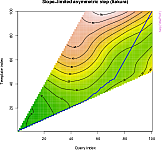
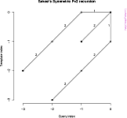
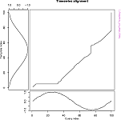

# Welcome to the Dynamic Time Warp project!

Comprehensive implementation of Dynamic Time Warping algorithms in R
and Python.  Supports arbitrary local (eg symmetric, asymmetric,
slope-limited) and global (windowing) constraints, fast native code,
several plot styles, and more.

The R Package
[dtw](http://cran.r-project.org/web/packages/dtw/index.html) provides
the most complete, freely-available (GPL) implementation of Dynamic
Time Warping-type (DTW) algorithms up to date.  The package
[dtwr](https://pypi.org/project/dtwr/) is a direct Python equivalent.

The package is described in a [companion
paper](http://www.jstatsoft.org/v31/i07/), including detailed
instructions and extensive background on things like multivariate
matching, open-end variants for real-time use, interplay between
recursion types and length normalization, history, etc.

### Description

DTW is a family of algorithms which compute the local stretch or
compression to apply to the time axes of two timeseries in order to
optimally map one (query) onto the other (reference). DTW outputs the
remaining cumulative distance between the two and, if desired, the
mapping itself (warping function). DTW is widely used e.g. for
classification and clustering tasks in econometrics, chemometrics and
general timeseries mining.

The R implementation in [dtw](http://www.jstatsoft.org/v31/i07/)
provides:

  - arbitrary windowing functions (global constraints), eg. the
    [Sakoe-Chiba
    band](http://ieeexplore.ieee.org/stamp/stamp.jsp?arnumber=01163055)
    and the [Itakura
    parallelogram](http://ieeexplore.ieee.org/xpls/abs_all.jsp?arnumber=1162641);
  - arbitrary transition types (also known as step patterns, slope
    constraints, local constraints, or DP-recursion rules). This
    includes dozens of well-known types:
      - all step patterns classified by
        [Rabiner-Juang](http://www.worldcat.org/oclc/26674087),
        [Sakoe-Chiba](http://ieeexplore.ieee.org/xpls/abs_all.jsp?arnumber=1163055),
        and [Rabiner-Myers](http://hdl.handle.net/1721.1/27909);
      - symmetric and asymmetric;
      - Rabiner's smoothed variants;
      - arbitrary, user-defined slope constraints
  - partial matches: open-begin, open-end, substring matches
  - proper, pattern-dependent, normalization (exact average distance per
    step)
  - the Minimum Variance Matching (MVM) algorithm [(Latecki et
    al.)](http://dx.doi.org/10.1016/j.patcog.2007.03.004)

Multivariate timeseries can be aligned with arbitrary local distance
definitions, leveraging the `proxy::dist` (R) or
`scipy.spatial.distance.cdist` (Python) function. 

In addition to computing alignments, the package provides:

  - methods for plotting alignments and warping functions in several
    classic styles (see plot gallery);
  - graphical representation of step patterns;
  - functions for applying a warping function, either direct or inverse;
  - fast native (C) core.

### Documentation

The best place to learn how to use the package (and a hopefully a decent
deal of background on DTW) is the companion paper [Computing and
Visualizing Dynamic Time Warping Alignments in R: The dtw
Package](http://www.jstatsoft.org/v31/i07/), which the Journal of
Statistical Software makes available for free.

To have a look at how the *dtw* package is used in domains ranging from
bioinformatics to chemistry to data mining, have a look at the list of
[citing
papers](http://scholar.google.it/scholar?oi=bibs&hl=it&cites=5151555337428350289).

A link to prebuilt documentation is
[here](http://www.rdocumentation.org/packages/dtw).

### Citation

If you use *dtw*, do cite it in any publication reporting results
obtained with this software. Please follow the directions given in
`citation("dtw")`, i.e. cite:

> Toni Giorgino (2009). *Computing and Visualizing Dynamic Time Warping
> Alignments in R: The dtw Package.* Journal of Statistical Software,
> 31(7), 1-24,
> [doi:10.18637/jss.v031.i07](http://dx.doi.org/10.18637/jss.v031.i07).

When using partial matching (unconstrained endpoints via the
`open.begin`/`open.end` options) and/or normalization strategies, please
also cite:

> Paolo Tormene, Toni Giorgino, Silvana Quaglini, Mario Stefanelli
> (2008). Matching Incomplete Time Series with Dynamic Time Warping: An
> Algorithm and an Application to Post-Stroke Rehabilitation. Artificial
> Intelligence in Medicine, 45(1), 11-34.
> [doi:10.1016/j.artmed.2008.11.007](http://dx.doi.org/10.1016/j.artmed.2008.11.007)

### Plot gallery

Go to a [gallery of sample plots](images/index.html) (straight out of
the examples in the documentation).

### Quickstart Example

    ## A noisy sine wave as query
    idx<-seq(0,6.28,len=100);
    query<-sin(idx)+runif(100)/10;
    
    ## A cosine is for template; sin and cos are offset by 25 samples
    template<-cos(idx)
    
    ## Find the best match with the canonical recursion formula
    library(dtw);
    alignment<-dtw(query,template,keep=TRUE);
    
    ## Display the warping curve, i.e. the alignment curve
    plot(alignment,type="threeway")
    
    ## Align and plot with the Rabiner-Juang type VI-c unsmoothed recursion
    plot(
        dtw(query,template,keep=TRUE,
            step=rabinerJuangStepPattern(6,"c")),
        type="twoway",offset=-2);
    
    ## See the recursion relation, as formula and diagram
    rabinerJuangStepPattern(6,"c")
    plot(rabinerJuangStepPattern(6,"c"))
    
    ## And much more!  
    Try online

### Installation

To install the latest [stable
build](http://cran.r-project.org/web/packages/dtw/index.html) of the
package (hosted at CRAN), issue the following command in the R
console:  

    > install.packages("dtw")

  

To get started, begin from the installed documentation:  

    > library(dtw) 
    > demo(dtw)
    > ?dtw 
    > ?plot.dtw

### License

This software is distributed under the terms of the GNU General Public
License Version 2, June 1991. The terms of this license are in a file
called COPYING which you should have received with this software and
which can be displayed by ` RShowDoc("COPYING")`.

### Contact

[Toni dot Giorgino](https://sites.google.com/site/tonigiorgino/) at
gmail.com  
  
Istituto di Neuroscienze (ISIB-IN-CNR)  
Consiglio Nazionale delle Ricerche  
Padova, Italy  
  
Academic and public research institutions are welcome to invite me for
discussions or seminars. Please indicate dates, preferred format, and
audience type.

### Commercial support

I am also interested in hearing from companies seeking to use DTW in a
commercial setting. I may provide on-site and/or remote consultancy
through the [Istituto di Biofisica](http://www.ibf.cnr.it/).

  
  
  
  
  
$Id: index.php 441 2019-07-31 06:53:16Z tonig $
