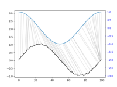
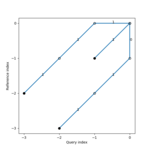

# *dtw-python*: Dynamic Time Warping in Python

The [dtw-python](https://pypi.org/project/dtw-python/) module is a
faithful Python equivalent of the R package; it provides the same
algorithms and options.

!!! warning
    The (pip) package name is `dtw-python`; the import
	statement is just `import dtw`.


## Installation

To install the stable version of the package,
issue the following command:

```bash
pip install dtw-python
```
  

## Getting started

Begin from the installed documentation:

```python
> from dtw import *
> ?dtw
> help(DTW)
```

!!! note 
    Note: the documentation for the Python module is
    auto-generated from the R version. It may contain 
    minor inconsistencies.


## Online documentation

The package documentation can also be [browsed
online](py-api/html/index.html).

## Quickstart

```python
import numpy as np

## A noisy sine wave as query
idx = np.linspace(0,6.28,num=100)
query = np.sin(idx) + np.random.uniform(size=100)/10.0

## A cosine is for template; sin and cos are offset by 25 samples
template = np.cos(idx)

## Find the best match with the canonical recursion formula
from dtw import *
alignment = dtw(query, template, keep_internals=True)

## Display the warping curve, i.e. the alignment curve
alignment.plot(type="threeway")

## Align and plot with the Rabiner-Juang type VI-c unsmoothed recursion
dtw(query, template, keep_internals=True, 
	step_pattern=rabinerJuangStepPattern(6, "c"))\
	.plot(type="twoway",offset=-2)

## See the recursion relation, as formula and diagram
print(rabinerJuangStepPattern(6,"c"))
rabinerJuangStepPattern(6,"c").plot()

## And much more!
```

	

[](py-images/Figure_1.png)
[](py-images/Figure_2.png)
[](py-images/Figure_3.png) &emsp; 
<!-- [Try online!](https://mybinder.org/v2/gh/DynamicTimeWarping/notebooks/master?filepath=quickstart%2FPython.ipynb) -->
[Try online!](https://colab.research.google.com/drive/1-fbhBlKRrEG8jkqoBAWOAzWaOarDQcDp)


## Differences with R

### Indices are 0-based

R uses 1-based indexing, whereas Python uses 0-based arrays. Wherever
indices are returned (most notably in the `.index1`, `.index2`,
`.index1s` and `.index2s` attributes of alignments), these must be
assumed to be 0-based in Python. Hence, indices can be used as
subscripts in both environments as expected.


### Object-oriented methods

Python OO method calls use the postfix "dot" notation. This mostly
affects the `plot()` methods. Note that non-overloaded functional
style such as `dtwPlotThreeWay` are unaffected.  Hence:

```
## In R
plot(alignment, type="threeway")

## In Python
alignment.plot(type="threeway")
## or
dtwPlotThreeWay(alignment)
```


### The alignment class

The class name of alignment objects in `DTW` (all capitals) in Python.
Its attributes are accessed with the usual "dot" notation (R uses `$` as
for lists).

### Dots vs underscores

R commonly uses the dot (`.`) separator for function argument names,
while Python uses the underscore (`_`) for the same purpose. The
function prototypes reflect this difference. Also, Python does not
accept abbreviated argument names. Therefore:

```
## In R
alignment = dtw(query, template, keep.int=TRUE)

## In Python
alignment = dtw(query, template, keep_internals=True)
```


### Plots

The graphing functions have been re-implemented within the
`matplotlib` framework. They return `axes` objects, which can be used
to customize the plot appearance.

