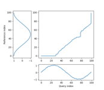

# The *dtwr* package for Python

The [dtwr](https://pypi.org/project/dtwr/) module is a faithful Python
equivalent of the R package; it provides the same algorithms and
options. The graphing functions have been re-implemented within the
`matplotlib` framework.

!!! warning
    The module name is `dtwr` (note the final `r`) because of clashes
    with pre-exising packages on PyPi.


## Installation

To install the stable version of the package,
issue the following command:

```bash
pip install dtwr
```
  

## Getting started

Begin from the installed documentation:

```python
> from dtwr import *
> ?dtw
> help(DTW)
```

!!! note 
    Note: the documentation for the Python module is
    auto-generated from the R version. It may contain 
    minor inconsistencies.

The package documentation can also be [browsed
online](https://www.rdocumentation.org/packages/dtw).

## Quickstart

```python
import numpy as np

## A noisy sine wave as query
idx = np.linspace(0,6.28,num=100)
query = np.sin(idx) + np.random.uniform(size=100)/10.0

## A cosine is for template; sin and cos are offset by 25 samples
template = np.cos(idx)

## Find the best match with the canonical recursion formula
from dtwr import *
alignment = dtw(query, template, keep_internals=True)

## Display the warping curve, i.e. the alignment curve
alignment.plot(type="threeway")

## Align and plot with the Rabiner-Juang type VI-c unsmoothed recursion
dtw(query, template, keep_internals=True, 
	step_pattern=rabinerJuangStepPattern(6, "c"))\
	.plot(type="twoway",offset=-2)

## See the recursion relation, as formula and diagram
print(rabinerJuangStepPattern(6,"c"))
rabinerJuangStepPattern(6,"c").plot()

## And much more!
```

	

[](py-images/Figure_1.png)
[](py-images/Figure_2.png)
[](py-images/Figure_3.png) &emsp; 
[Try online!](https://rnotebook.io/anon/5f3ddc63ac17d7cf/notebooks/Welcome.ipynb)


## Implementation differences

### Indexing is 0-based

R uses 1-based indexing, whereas Python uses 0-based arrays. Wherever
indices are returned (most notably in the `.index1`, `.index2`,
`.index1s` and `.index2s` attributes of alignments), these must be
assumed to be 0-based in Python. Of note, indices may be used as
subscripts as expected in both environments.


### Object-orientation

The Python interface has been modeled to be as close as possible to
the R one. Therefore, object-orientation method calls is only used for
the `plot()` functions. Note that:

```
## In R
plot(alignment, type="threeway")

## In Python
alignment.plot(type="threeway")
```

Non-overloaded functions with explicit names such as `dtwPlotThreeWay`
work without changes.

### The alignment class

The class name of alignment objects in `DTW` (all capitals) in Python.
Attributes are accessed with the usual "dot" notation (R uses `$` as
for lists).

### Dot vs underscore in argument names

R commonly uses the dot (`.`) separator for function argument names,
while Python uses the underscore (`_`) for the same purpose. The
function prototypes reflect this difference. Also, only R allows
abbreviated argument names. Therefore:


```
## In R
alignment = dtw(query, template, keep.int=TRUE)

## In Python
alignment = dtw(query, template, keep_internals=True)
```

